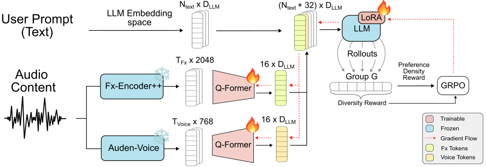

# Audio-Aware EQ Recommender System for Natural-Language Audio Control

[](https://www.python.org/)
[](LICENSE)
[](https://pytorch.org/)
[](https://huggingface.co/)

An intelligent, audio-aware equalization (EQ) recommendation system that maps open-ended natural-language instructions (e.g., *"make the sound warmer"*, *"enhance vocal clarity"*, *"reduce harshness"*) and playback audio signals to continuous, two-dimensional parametric EQ control settings.

Trained using **Group Relative Policy Optimization (GRPO)** on **Qwen3.5-0.8B**, the system aligns with user preference distributions derived directly from user feedback without requiring a separate reward model.

---

## 1. Project Overview

### The Challenge
Equalization shapes the spectral balance, clarity, and mood of recorded audio. In commercial audio systems, EQ is typically confined to static presets or complex manual equalizers that require technical expertise. 

While Large Language Models (LLMs) can interpret natural-language requests, **text-only conditioning lacks physical acoustic context**:
- A request to *"reduce harshness"* requires completely different filter adjustments for a bright acoustic guitar versus a distorted vocal or a podcast.
- In subjective audio tasks, an instruction rarely maps to a single "correct" ground-truth coordinate—different listeners exhibit valid, multimodal preferences.
- Standard multimodal LLMs often suffer from **modality collapse** or **text shortcuts**, relying purely on textual semantics while ignoring the audio signal.

### The Solution
This system introduces a grounded multimodal architecture that conditions a compact LLM on acoustic signals via specialized, frozen encoders and learnable cross-attention adapters:



1. **Dual Specialized Encoders**: Captures mix production qualities via **Fx-Encoder++** and speech/vocal nuances via **Auden-Voice**.
2. **Temporal Q-Former Adapters**: Projects chronological acoustic features into the LLM embedding space using 16 learnable query tokens per stream (32 tokens total), preserving time-resolved dynamics without destructive global pooling.
3. **Continuous Preference Alignment via GRPO**: Directly optimizes the model policy against a continuous preference density surface constructed via Reflective Kernel Density Estimation (KDE), regularized by a pairwise geometric diversity reward to prevent mode collapse.

---

## 2. System Architecture

### 2.1 Control Plane: The Beosonic Equalizer Space
Following Bang & Olufsen's **Beosonic** interface, the equalizer transfer function is parameterized as a continuous 2D coordinate plane:

$$\mathcal{X} \in [-6, 6] \times [-6, 6]$$

- **Horizontal Axis ($x \in [-6, 6]$)**: Controls a "smile curve" filter (boosting low bass and high treble while scooping mids, or vice-versa).
- **Vertical Axis ($y \in [-6, 6]$)**: Applies a linear spectral tilt adjustment (tilting the overall balance between warm/dark and bright/sharp).

The recommender system predicts an optimal coordinate $(x, y) \in \mathcal{X}$ given a user text prompt and the audio clip.

### 2.2 Dual Audio Feature Encoders
Audio conditioning uses two complementary, frozen feature extractors operating on 5-second audio windows:

| Feature Stream | Encoder Backbone | Output Shape | Acoustic Domain |
| :--- | :--- | :--- | :--- |
| **FX Stream** | [Fx-Encoder++](https://arxiv.org/abs/2507.02273) (Conv6) | $[T_{\text{Fx}}, 2048]$ | Instrument-wise mix balance, spatial depth, reverberation, and production character. |
| **Voice Stream** | [Auden-Voice](https://arxiv.org/abs/2511.15145) (Zipformer) | $[T_{\text{Voice}}, 768]$ | Paralinguistic cues, vocal formants, sibilance, speech clarity, and narrator tone. |

### 2.3 Temporal Q-Former Cross-Attention Adapters
To preserve chronological acoustic information, each stream connects to the language model via an independent **Q-Former adapter**:
- Features are linearly projected to the LLM hidden dimension ($D_{\text{LLM}} = 1024$).
- A set of $N_q = 16$ learnable query tokens attends to the chronological feature frames using 8-head cross-attention, followed by a Feed-Forward Network (FFN) and Layer Normalization.
- The resulting 16 FX tokens and 16 Voice tokens (32 audio tokens total) are prepended to the LLM input sequence at special placeholder positions (`<|audio|>` and `<|voice|>`) before the user prompt tokens.

### 2.4 LLM Backbone: Qwen3.5-0.8B with LoRA
The reasoning engine is **Qwen3.5-0.8B**, fine-tuned with Low-Rank Adaptation (LoRA, $r=8, \alpha=16$) applied across its hybrid architecture:
- **Standard Self-Attention Layers** (Layers 7, 11, 15, 19, 23): Adapts query, key, value, and output projection matrices (`q_proj`, `k_proj`, `v_proj`, `o_proj`).
- **DeltaNet Linear Attention Layers** (19 layers): Adapts linear attention projection matrices (`in_proj_qkv`, `out_proj`, `in_proj_b`).
- **Feed-Forward Networks** (All 24 layers): Adapts MLP projections (`gate_proj`, `up_proj`, `down_proj`).

---

## 3. Training & Preference Alignment via GRPO

Traditional RLHF requires training a separate reward model, introducing training overhead and susceptibility to reward hacking. Here, the policy is optimized directly against empirical user preferences using **Group Relative Policy Optimization (GRPO)**.

### 3.1 Direct Preference Density (Exploitation)
From an initial dataset of $\approx 90,000$ real user interaction events across diverse prompts, we estimate the continuous probability that a coordinate $x \in \mathcal{X}$ is rated positively:

$$P(\text{Positive} \mid x) \propto \frac{\hat{f}_{\text{pref}}(x)}{\hat{f}_{\text{total}}(x) + \epsilon}$$

Both densities are estimated using **Reflective Kernel Density Estimation (KDE)**, which mirrors points across domain boundaries to eliminate edge bias in bounded spaces ($[-6, 6]^2$). The prompt-conditioned preference density reward is:

$$R_{\text{pref}} \in [-1.0, 1.0]$$

### 3.2 Pairwise Geometric Diversity Reward (Exploration)
Because user preferences for an audio instruction can be inherently multimodal (e.g., several valid EQ curves satisfy "more clarity"), models trained solely on mode density risk collapsing into a single narrow point. To prevent this, rollouts in group $G$ ($G = 16$) are rewarded for geometric spread:

$$R_{\text{div}, i} = \text{scale} \cdot \left( \frac{2 \cdot d_{\text{mean}, i}}{D_{\text{max}}} - 1.0 \right)$$

where $d_{\text{mean}, i}$ is the mean Euclidean distance from candidate prediction $i$ to all other valid candidates in the group, and $D_{\text{max}} = 12\sqrt{2}$. The overall rollout reward is:

$$r_i = 0.75 \cdot R_{\text{pref}, i} + 0.25 \cdot R_{\text{div}, i}$$

---

## 4. Key Empirical Discoveries

### 4.1 Causal Audio Grounding (Feature-Swap Analysis)
To verify that the model genuinely listens to the audio rather than memorizing prompt-to-coordinate shortcuts, we performed a **causal audio-swap test**. During evaluation, the audio features for a prompt were replaced with features from unrelated donor tracks:

| Perturbation | Domain Match | Euclidean Shift ($\Delta L_2$) | Preference Density ($R_{\text{pref}}$) |
| :--- | :--- | :---: | :---: |
| **Baseline (Original Audio)** | — | **0.00** | **0.75 ± 0.25** |
| **FX-only Swap** | In-Domain | $1.78 \pm 3.15$ | $0.48 \pm 0.42$ |
| | Cross-Domain | $1.91 \pm 3.08$ | $0.46 \pm 0.40$ |
| **Voice-only Swap** | In-Domain | $1.69 \pm 3.09$ | $0.54 \pm 0.44$ |
| | Cross-Domain | $2.75 \pm 3.61$ | $0.32 \pm 0.50$ |
| **Both Streams Swapped** | In-Domain | $3.40 \pm 3.70$ | $0.27 \pm 0.48$ |
| | Cross-Domain | **5.14 ± 4.45** | **0.09 ± 0.43** |
| | **Overall** | **4.27 ± 4.18** | **0.18 ± 0.47** |

- **Proof of Acoustic Grounding**: Replacing both streams causes a steep collapse in preference density ($0.75 \to 0.18$), confirming that predictions causally depend on input audio.
- **Double Dissociation**: Voice-only swaps exhibit sharp cross-domain sensitivity (density drops from $0.54$ in-domain to $0.32$ cross-domain), while FX-only swaps reliably detect track-level alterations across all domains.

### 4.2 Perceptual Listening Test (MUSHRA)
We conducted a blinded, multi-stimulus perceptual listening experiment (MUSHRA, ITU-R BS.1534) with 25 screened listeners evaluating 22 held-out (prompt, audio) pairs across 3 content categories (Instrumental, Audiobook, and Mixed = sung Music + Movie dialogue/score, merged since both combine vocals with other sound) (Scale: 0–100). Values are estimated marginal means $\pm$ SE from a joint mixed model (`glmmTMB`: `model × category` fixed effects, crossed listener/prompt random effects, per-condition residual variance):

| Category | Condition | Instrumental ($N=175$) | Audiobook ($N=200$) | Mixed ($N=175$) | Overall ($N=550$) |
| :--- | :--- | :---: | :---: | :---: | :---: |
| Baselines | Tonmeister (Expert) | $44.86 \pm 2.68$ | **$43.28 \pm 2.54$** | $41.10 \pm 2.68$ | **$43.09 \pm 1.78$** |
| | ICL (4B) | $35.55 \pm 2.65$ | $40.97 \pm 2.51$ | $40.89 \pm 2.65$ | $39.22 \pm 1.76$ |
| | Hidden Reference | $26.56 \pm 2.44$ | $31.27 \pm 2.32$ | $29.67 \pm 2.44$ | $29.26 \pm 1.66$ |
| | No Audio (0.8B) | $42.48 \pm 2.78$ | $36.48 \pm 2.63$ | $35.00 \pm 2.78$ | $37.92 \pm 1.82$ |
| Audio-Conditioned | Voice-only (0.8B) | **$50.42 \pm 2.84$** | $41.87 \pm 2.69$ | $21.34 \pm 2.84$ | $38.06 \pm 1.85$ |
| | FX-only (0.8B) | $38.74 \pm 2.87$ | $26.00 \pm 2.72$ | **$41.22 \pm 2.87$** | $34.90 \pm 1.87$ |
| | Voice+FX (0.8B Dual) | $27.55 \pm 2.87$ | $25.62 \pm 2.72$ | $34.55 \pm 2.87$ | $29.08 \pm 1.87$ |

Pairwise significance for a fixed set of 7 planned (comparison, category) combinations (corrected via the multivariate-t adjustment, Hothorn et al., 2008, as one family — not a full pairs $\times$ categories cross product, and not Holm-Bonferroni's independence-worst-case penalty) is in `Listening_Exp/Perceptual_evaluation/lmm_contrasts.tex`.

### 4.3 Key Takeaways & Design Insights

1. **Voice-only Beats Both the Text-Only Baseline and a 5x Larger LLM, on Its Best-Fit Domain**: On Instrumental, Voice-only significantly outperforms both No-Audio ($+7.94$, $p_{\text{adj}}=0.015$) and the $5\times$ larger Qwen3.5-4B (ICL, $+14.86$, $p_{\text{adj}}=1.05\times 10^{-8}$) — the highest score in the study on that category ($50.42$). It does not significantly beat Tonmeister there ($+5.56$, n.s.), and the advantage over No-Audio does not extend to Audiobook ($+5.39$, n.s.).
2. **FX-only Does Not Significantly Beat Anything on Mixed, Despite the Highest Raw Mean**: FX-only has the highest raw mean on Mixed ($41.22$) but is n.s. against No-Audio ($+6.22$), ICL ($+0.33$), and Tonmeister ($+0.11$) there — the raw lead is not statistically reliable.

---

## 5. Repository Structure

```
repo_Audio_aware_recommender_system/
├── README.md                                  # Human-readable project overview (this file)
├── AGENT.md                                   # Complete technical reference for AI agents
├── fx_voice_GRPO.png                          # Architecture & training schematic
├── .env.example                               # Environment variable template (WandB API key)
│
├── Data_dir/
│   ├── prompt_to_fx_windowed.pkl              # Windowed Fx-Encoder++ features [T, 2048]
│   ├── prompt_to_voice_windowed.pkl           # Windowed Auden-Voice features [T, 768]
│   ├── fx_sample_id_provenance.pkl            # Provenance mapping for FX feature windows
│   ├── voice_sample_id_provenance.pkl         # Provenance mapping for Voice feature windows
│   ├── prompts_and_audio_data.json            # Dataset prompt text and track metadata
│   ├── original_audio_trimmed/                # 5-second source audio clips (WAV, 44.1 kHz)
│   └── reward_models/
│       ├── reward_models_augmented_train.pkl  # Continuous KDE preference densities (Train)
│       ├── reward_models_augmented_val.pkl    # Continuous KDE preference densities (Val)
│       └── reward_models_simulated_val.pkl    # Synthetic validation set for quick tests
│
├── src/
│   ├── Data_setup/
│   │   ├── extract_fx_features.py             # Feature extraction with Fx-Encoder++
│   │   ├── extract_voice_features.py          # Feature extraction with Auden-Voice
│   │   ├── generate_reward_models.py          # Reflective KDE preference density estimator
│   │   ├── visualize_predictions.py           # 2D coordinate scatter visualizer
│   │   ├── visualize_attention.py             # Attention matrix routing visualizer
│   │   └── visualize_reward_models.py         # KDE reward surface visualizer
│   │
│   ├── Training_Scripts/
│   │   ├── t2b_fx_and_voice_GRPO.py           # Dual-stream GRPO training script
│   │   ├── t2b_fx_GRPO.py                     # FX-only GRPO training script
│   │   ├── t2b_voice_GRPO.py                  # Voice-only GRPO training script
│   │   ├── parse_utils.py                     # Output parsing: completion -> 2D coordinate
│   │   └── prompts.py                         # System prompts with placeholder tokens
│   │
│   └── GRPO_models/
│       ├── infer_fx_and_voice.py              # Dual-stream inference entry point
│       ├── infer_fx.py                        # FX-only inference entry point
│       ├── infer_voice.py                     # Voice-only inference entry point
│       ├── infer_text.py                      # No-audio baseline inference
│       ├── grounding_swap_test.py             # Causal feature-swap evaluation script
│       ├── FX_Voice_model/checkpoint-7300/    # Dual-stream checkpoint
│       ├── FX_model/checkpoint-12600/         # FX-only checkpoint
│       ├── Voice_model/checkpoint-10700/      # Voice-only checkpoint
│       └── Text_only/checkpoint-9050/         # No-audio baseline checkpoint
│
└── Listening_Exp/
    └── Perceptual_evaluation/
        ├── analyze_perceptual_results.py      # Statistical evaluation (Friedman, Wilcoxon)
        ├── generate_model_predictions.py      # Generates full candidate prediction sets
        ├── generate_model_predictions_concise.py # Generates concise greedy predictions
        ├── prompt_audio_link.json             # Held-out prompt-audio linkage
        ├── model_predictions_concise.json     # Generated model coordinates for study
        ├── perceptual_ratings_tidy.csv        # MUSHRA listener ratings dataset (N=3,850)
        └── Results/                           # Raw individual listener JSON logs (30 assessors)

```

---

## 6. Getting Started

### 6.1 Installation
Clone the repository and set up your Python environment:

```bash
git clone https://github.com/your-username/Audio_aware_recommender_system.git
cd Audio_aware_recommender_system

# Create and activate a Python 3.10+ virtual environment
python -m venv .venv
source .venv/bin/activate  # On Windows: .venv\Scripts\activate

# Install dependencies
pip install torch transformers datasets trl peft wandb python-dotenv scipy pandas numpy
```

*(Optional)* Configure your Weights & Biases API key for training logs:
```bash
cp .env.example .env
# Edit .env and insert your WANDB_API_KEY
```

### 6.2 Running Inference
To generate EQ coordinates from natural language and audio:

```bash
# Dual-Stream Inference (FX + Voice)
python src/GRPO_models/infer_fx_and_voice.py \
    --prompt "Make the vocals sound crisper and reduce boominess" \
    --track "BorderlessPodcast.wav"

# FX-Only Inference
python src/GRPO_models/infer_fx.py \
    --prompt "Add warmth and punch to the drums" \
    --track "KingsOfLeonSexonFire.wav"

# Voice-Only Inference
python src/GRPO_models/infer_voice.py \
    --prompt "Enhance clarity of the speech" \
    --track "dev228.wav"
```

### 6.3 Evaluating Causal Grounding
To execute the causal feature-swap test to confirm acoustic grounding:

```bash
python src/GRPO_models/grounding_swap_test.py \
    --checkpoint src/GRPO_models/FX_Voice_model/checkpoint-7300 \
    --num_donors 3 \
    --output_json results/grounding_swap_results.json
```

### 6.4 Analyzing Perceptual Listening Results
To reproduce the statistical significance tables from the MUSHRA study:

```bash
python Listening_Exp/Perceptual_evaluation/analyze_perceptual_results.py
```

---

## 7. Model Checkpoints

Pre-trained weights are located in `src/GRPO_models/`:

| Model Architecture | Path | Training Steps | Best Suited For |
| :--- | :--- | :---: | :--- |
| **FX + Voice Dual Model** | `src/GRPO_models/FX_Voice_model/checkpoint-7300` | 7,300 | Multi-stream exploration |
| **FX-Only Specialist** | `src/GRPO_models/FX_model/checkpoint-12600` | 12,600 | Music mixes, rhythm sections, production |
| **Voice-Only Specialist** | `src/GRPO_models/Voice_model/checkpoint-10700` | 10,700 | Audiobook, dialogue, speech clarity |
| **No-Audio Baseline** | `src/GRPO_models/Text_only/checkpoint-9050` | 9,050 | Text-only control baseline |

---

## 8. Technical Documentation for Agents
For detailed code conventions, tensor dimensions, exact mathematical derivations, LoRA parameter namespaces, and common gotchas, refer to **[AGENT.md](AGENT.md)**.
